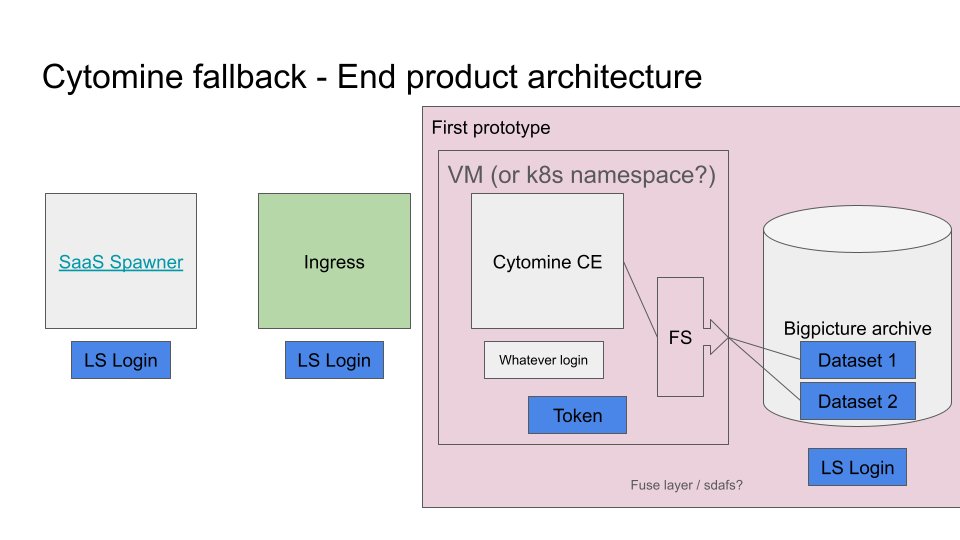

# Cytomine Fallback

## Overview

This repository contains the code and resources for the Cytomine Fallback project. The project is designed to provide a service allowing users to log in using LS Login and access the Cytomine service for collaborative analysis of very large bio-medical images. Once authorized, users can launch a Cytomine instance on Kubernetes or a VM, integrating with backend systems like the Bigpicture archive.

## Features

- **LS Login & Keycloak Integration:** Users sign in using their home organisation credentials, community identities, or social accounts (e.g., Google, LinkedIn). Keycloak integration enables Single Sign-On (SSO) capabilities for a streamlined authentication process across services.
- **On-Demand Cytomine Service:** Enables users to launch an instance of Cytomine on a Kubernetes namespace or as an alternative on a VM.
- **Dataset Handling:** Storage and sensitive data management (prototype phase: non-sensitive mock dataset).
- **Filesystem Wrapper:** An interface for the Bigpicture archive that is potentially compatible with existing tools like sda-download or CSC Data Gateway.

## Getting Started

1. Prepare your Kubernetes cluster or VM infrastructure for deploying the Cytomine application.
2. Review the `xxx.md` file to set up your environment according to the specified requirements.
3. Consult the `yyy.md` file for instructions on how to configure and deploy the Cytomine service.

## Usage

After setup:

1. Users log in through the user page utilizing the LS Login method, with SSO provided by Keycloak.
2. They start the Cytomine service through a straightforward selection process.
3. Users can collaboratively analyze and annotate images with an intuitive interface.
4. There is the ability to use machine learning algorithms for semi-automatic image processing.

## Dependencies

- Kubernetes/VM infrastructure
- LS Login service
- Integration with Keycloak for SSO
- Bigpicture archive or a mock version for non-sensitive data handling
- Sensitive Data Archive (SDA) tools for data management (applicable when using real datasets)

## Security

The service leverages LS Login and Keycloak for secure authentication, ensuring that user credentials are managed according to industry best practices, maintaining data integrity and confidentiality.

## Reporting Issues and Contributing

If you encounter any issues or would like to propose new features or enhancements, please create an issue in the repository. We also welcome contributions via pull requests after discussion through raised issues. For detailed instructions on how to contribute, please see the `CONTRIBUTING.md` file.

## Keycloak Integration with LS Login

Keycloak has been integrated with LS Login within our service to ensure seamless SSO capability across multiple related services. Once a user is authenticated via Keycloak, they are granted access without additional logins. Moreover, Keycloak facilitates single sign-out, allowing users to log out from all sessions across services integrated with Keycloak with a single action.

## Contact

For any questions or support, please open an issue in the repository, and a maintainer will respond as soon as possible.
